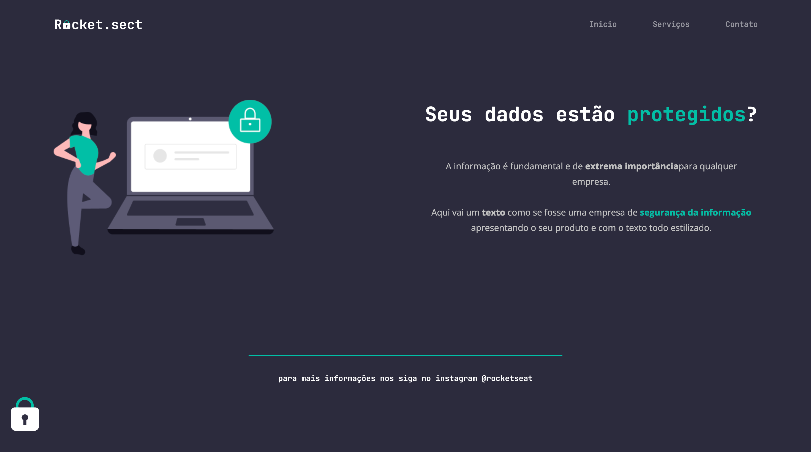

# Desafio intermediário: Rocket Sect

Projeto construido do curso Explorer da Rocketseat, desafio intermediário onde codamos pela primeira vez sozinhos, pondo em prática as aulas anteriores.

## Tecnologias

- HTML
- CSS
- Figma
- Git e Github

## Demonstração

Clique no link abaixo para acessar.

https://graziela-redigolo.github.io/desafio-rocket.sect

## Contatos

LinkedIn: https://www.linkedin.com/graziela-redigolo

GitHub: https://github.com/graziela-redigolo

E-mail: graziela.redigolo@gmail.com
